# Overview

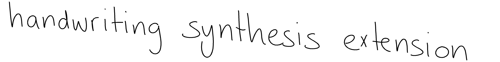

This repository aims to produce synthesized handwriting that is indistinguishable from human generated handwriting. It builds upon [X-rayLaser's](https://github.com/X-rayLaser/pytorch-handwriting-synthesis-toolkit) successful implementation of principles from Alex Graves's paper [Generating Sequences With Recurrent Neural Networks](https://arxiv.org/abs/1308.0850).

The project has four goals:
1. Set up a new data collection method
2. Streamline the extract, transform, load (ETL) process for custom datasets
3. Enhance model training and evaluation
4. Develop an additional machine learning layer to model stroke thickness

# Introduction
At a high level, Recurrent Neural Networks (RNNs) are models capable of generating sequences by using one step's output as the next step's input. This model structure is well-suited for generating lines of text point-by-point in a convincingly human-like manner. 

The model was trained on the [IAM On-Line Handwriting Database](https://fki.tic.heia-fr.ch/databases/iam-on-line-handwriting-database). The dataset consisted of handwritten text paired with pen data. The pen data is a list of coordinates the pen traveled while writing the text. After training, the model was then able to generate new handwriting by predicting the next pen coordinate given the previous pen coordinates and the text. The results produced impressive, but in my opinion, not human quality handwriting.

# New Data Collection Method
This model uses __online handwriting__, which refers to the process of collecting pen coordinates as the text is being written. This is different from __offline handwriting__, which involves analyzing already-written text from static images. As I did not have access to the data collection method used for the IAM dataset, I needed to find a new way to collect data.

After some trial and error, I settled on a Wacom Intuos tablet to collect my own handwriting. The tablet records pen coordinates, pen pressure, and pen state. This additional data on pen pressure will be used to build a new model. Using the Wacom SDK, I built a simple web app to collect more data. [More details](./app/README.md)

# ETL Process for Custom Datasets
[X-rayLaser's Toolkit](https://github.com/X-rayLaser/pytorch-handwriting-synthesis-toolkit) includes data processing tools for the IAM dataset. However, needed tools to extract and transform my own data into the correct format for training. I choose to break the data processing into three steps:
1. Extracting data collected from the tablet
2. Transforming the data in a custom fashion
3. Loading the data as model inputs

I used interactive Jupyter notebooks to document, provide clear explanation, and visualize the data transformation process. Hopefully this provides a user-friendly way to use custom datasets as well as and an quick way to customize model inputs for easy experimentation. [More details](./data/README.md)

# Model Training and Evaluation
Below is an overview of the model training and evaluation process. I experimented with different datasets and parameters to see how well the model could generalize to new data. I also fine-tuned the model with my own handwriting data to see if it could improve the quality of the generated handwriting.

** Work in Progress**
[See here](./data/README.md) for an analysis of the datasets used in this project and [here](./outcomes/README.md) for more detailed analysis and sample outputs from different training runs.

Note: The model training was too large to run on my Mac M1 Laptop so I used cloud based infrastructure and built tools to automate the training process. [More details](./infrastructure/README.md)

## IAM Dataset
First I trained the model on the IAM dataset to establish a baseline. I experimented with different batch sizes and maximum sequence lengths. The model was then evaluated using the mean squared error (MSE) and sum squared error (SSE) metrics, and the loss function.

**Batch Size 32**

  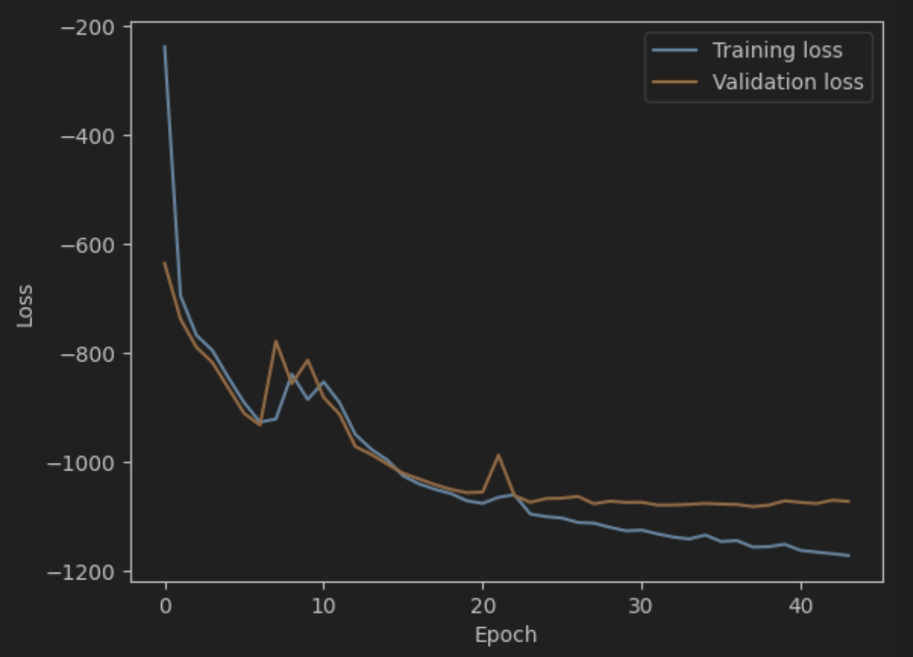
  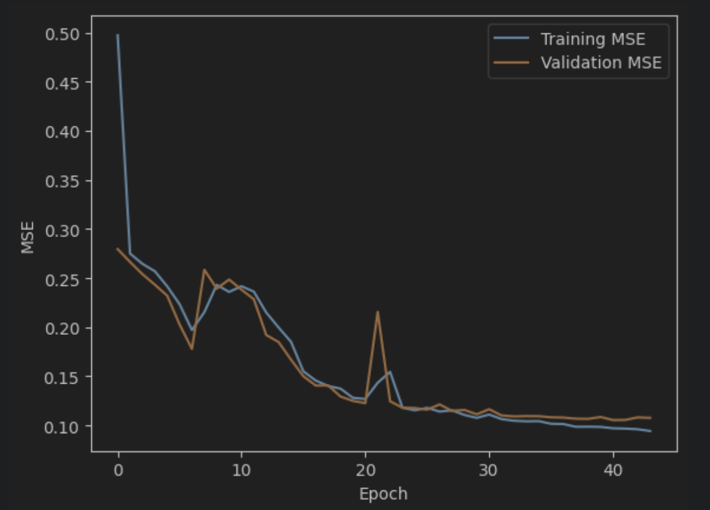 
  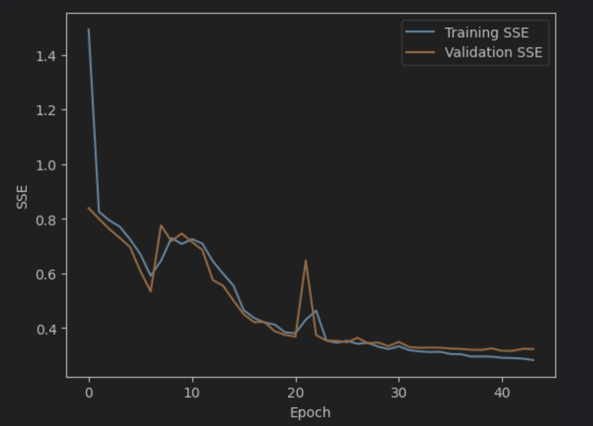

**Batch Size 64**

  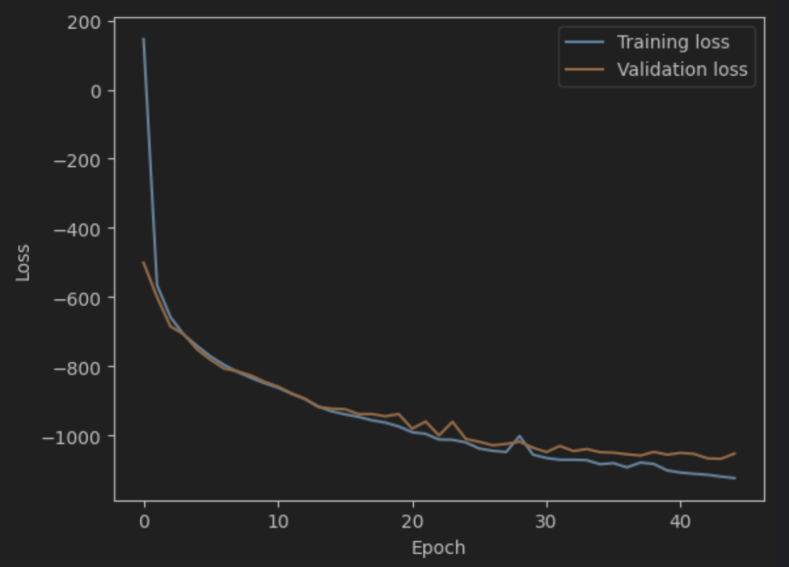
  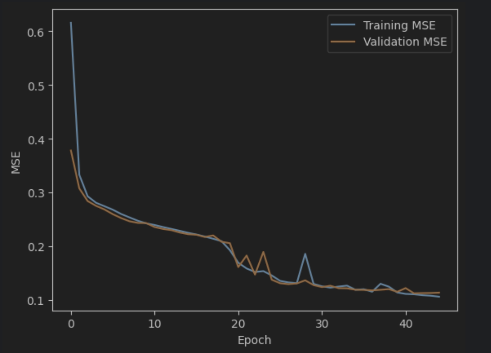 
  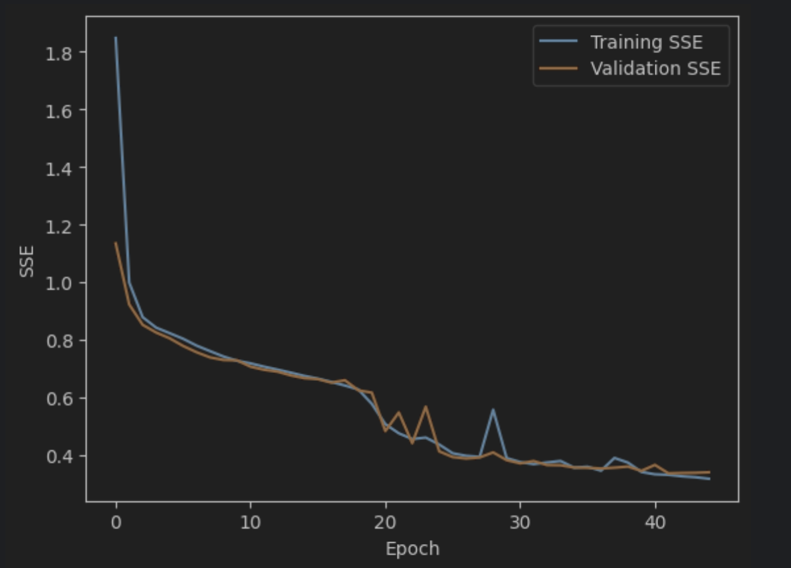

## Fine-Tuned IAM Dataset (Normalized)
**Fine-Tuned with my handwriting normalized to the IAM data**

  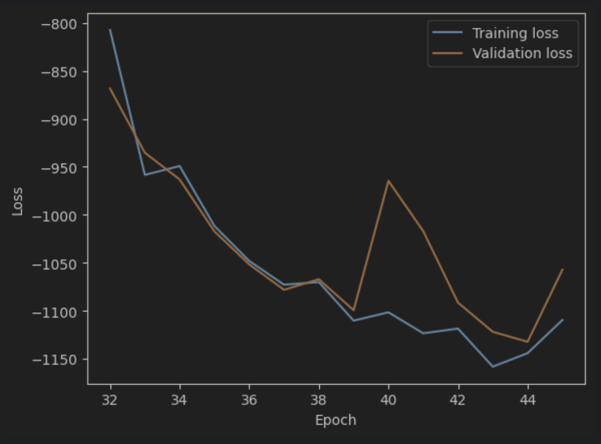
  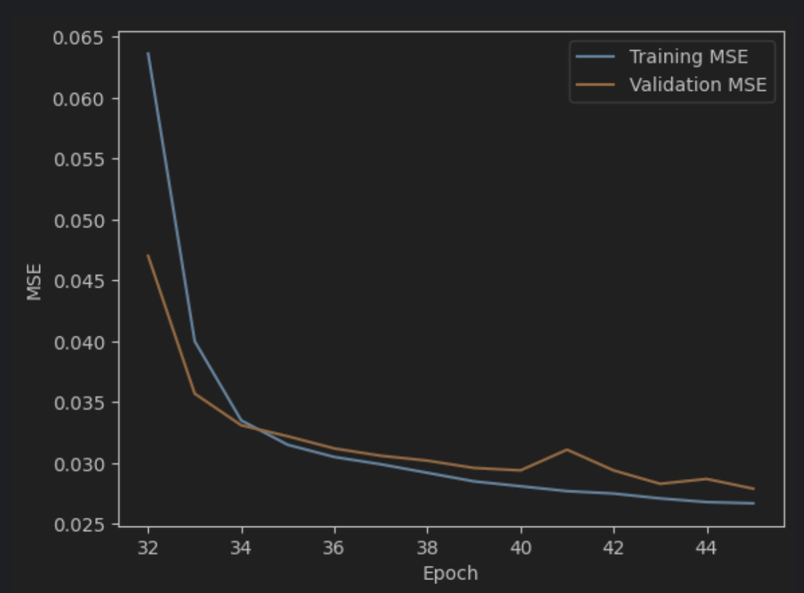 
  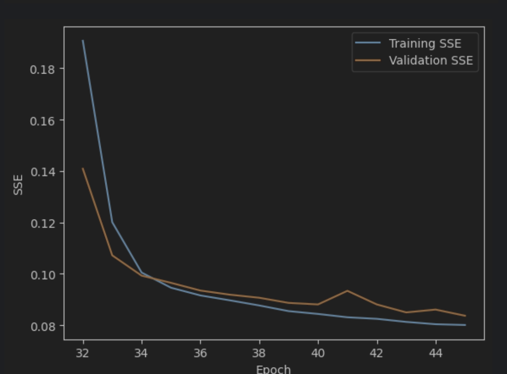

## Fine-Tuned IAM Dataset (Interpolated)
**Fine-Tuned with my handwriting with 1.2x points per character compared to the IAM data**

** Todo: Add more formal evaluations **

# Predicting Stroke Thickness with Pen Pressure
__Note: This is a work in progress.__

The current model only predicts pen coordinates / strokes. This is the primary dimension for reproducing handwriting. However, stroke thickness is another important dimension that contributes to the authenticity of handwriting. I am developing a additional model that predicts stroke thickness. I am assuming that pen pressure is a good proxy for stroke thickness. 

Luckily, pen data collected from Wacom tablets includes pen pressure so I don't need to develop any additional data collection methods. 

Below is a visualization of the pen pressure data collected from the Wacom tablet. Notice how the end of strokes has lower pen pressures. Intuitively, this makes sense as the pen is preparing to lift off the writing surface at the end of a stroke.
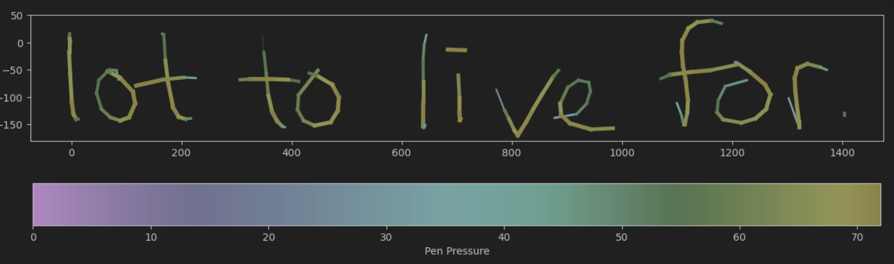

I am using an RNN as the model architecture for the pressure model as well. The model will take in the pen coordinates and pen pressure as inputs and predict the next pen pressure. I am currently training the model and will update this section with the results.

Questions I am trying to answer:
1. Can the model predict pen pressure with high accuracy?
2. Do the coordinates contain all the information needed to predict pen pressure? Or do we need to look at the transcript as well?
3. How much does pen pressure contribute to the authenticity of handwriting?
