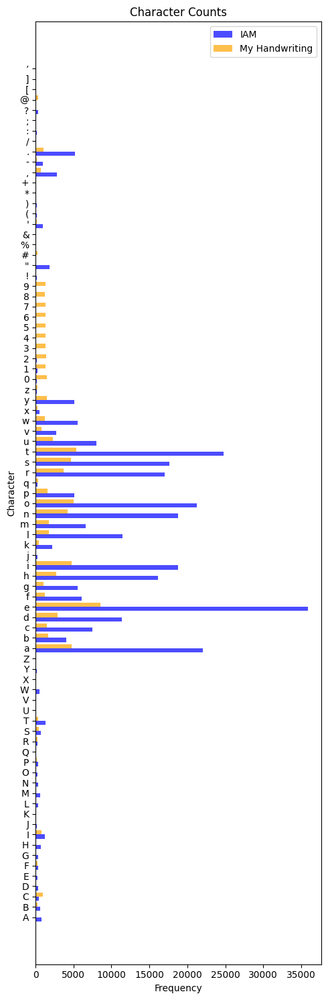

# Introduction

This repository aims to enhance [X-rayLaser's handwriting synthesis](https://github.com/X-rayLaser/pytorch-handwriting-synthesis-toolkit) project, with the goal of producing handwriting that is indistinguishable from human handwriting.

X-rayLaser's toolkit implements the principles from Alex Graves's paper [Generating Sequences With Recurrent Neural Networks](https://arxiv.org/abs/1308.0850).

At a high level, Recurrent Neural Networks (RNNs) are models capable of generating sequences by using one step's output as the next step's input. This model structure is well-suited for generating lines of text point-by-point in a convincingly human-like manner.

The model's inputs are lines: Text paired with the sequential points that form the text's handwriting. These points are arrays of tuples consisting of the x and y coordinates, as well as a boolean indicating if the point is the end of a pen stroke. The trained model synthesizes a sequence of pen strokes given any new string of text.

# Extensions and Enhancements

The original project was designed to work with a specific dataset. I extended the project by adding data processing tools to work with custom datasets, collected my own data, and experimented with various training parameters.

Additionally, to reproduce another dimension of human handwriting — the pressure of a pen's stroke — I built a model to predict pen pressure given a handwritten line and layered it on top of the existing model.

# Datasets
The original dataset, [IAM On-Line Handwriting Database](https://fki.tic.heia-fr.ch/databases/iam-on-line-handwriting-database), used for training the model, includes scripts to download and prepare the data. It consists of handwritten text paired with pen coordinates, making it a good starting point for training.

I then collected a lot of my own handwriting. Below is a comparison of the character counts between the IAM dataset and my handwriting dataset.

**IAM**
- Lines: 12,187
- Characters: 351,868
- Points: 7,651,948

**My Handwriting**
- Lines: 6,128
- Characters: 94,498
- Points: 1,546,069

You can see the IAM dataset is much larger. Also note that in my handwriting dataset I collected quite a few numbers [0-9] and special characters [.,!?]. I wanted to see how well the model could generalize to these characters.

Additional metrics can be found using the [data analysis notebook](./data/analyze.ipynb) and the [compare datasets notebook](./notebooks/compare_datasets.ipynb).

# Collecting Data
## Hardware
I used a Wacom Intuos tablet to collect the data. The tablet records pen coordinates, pen pressure, and pen state. This additional data on pen pressure will be used to build a new model.

## User Interface
** WIP **

For ongoing data collection, I built a simple web app to collect more data. See [/app](/app) for usage.

A major portion fo the app was integrating Wacom's SDK to collect the pen data. The SDK provides a way to collect pen coordinates, pen pressure, and pen state.

# Data Processing
Getting collected data into the correct format for training was a main driver of this project. I added functions and tool so that custom datasets can be used alongside the IAM dataset. I broke the data processing into three steps: [formatting](./data/format.ipynb), [analyzing](./data/analyze.ipynb), and [packaging](./data/package.ipynb). See the [/data README](./data/README.md) for more details and instructions on processing your own data.

Additionally, I created a new data provider, [CustomProvider](./handwriting_synthesis/data_providers/custom.py), to take the packaged data and prepare it for training. The one in x-rayLasers toolkit designed for the IAM dataset was fine, but I needed one that could handle the custom dataset (and I wanted to learn how it worked). I followed the instructions from [original toolkit](https://github.com/X-rayLaser/pytorch-handwriting-synthesis-toolkit?tab=readme-ov-file#data-preparation).

# Model Training and Evaluating
The model was trained using different datasets and parameters:
1. IAM dataset
4. IAM dataset fine-tuned with my handwriting dataset
2. Custom dataset
3. Combined dataset (IAM + Custom)

## IAM Dataset
**Batch Size 32**

  
   
  

**Batch Size 64**

  
   
  

## Fine-Tuned IAM Dataset (Normalized)
**Fine-Tuned with my handwriting normalized to the IAM data**

  
   
  

## Fine-Tuned IAM Dataset (Interpolated)
**Fine-Tuned with my handwriting with 1.2x points per character compared to the IAM data**

** Todo: Add more formal evaluations **

# Priming
The model can be primed with a sequence of pen coordinates to generate a sequence that follows the "style" of the primed sequence. More details are in the [notebooks](./notebooks/priming.ipynb).

# Pressure -- A New Model
** WIP **

To improve handwriting "authenticity", I plan to add pen pressure as a dimension in the model output. The new dataset includes pen pressure data collected using the Wacom Intuos tablet.

Rather than modifying the existing model, I plan on layering a new model on top of the existing one's output. 

I will experiment with different architectures: 
1. One that takes pen coordinates and pen state to output pen pressure.
2. Another that includes text in the input.

Visualization of pen pressure will be done using a [plotting technique](./notebooks/thickness.ipynb).

# Additional Resources

## Training Infrastructure
*Todo: Add details.*

## Dataflow Automation with Prefect
*Todo: Add details.*
